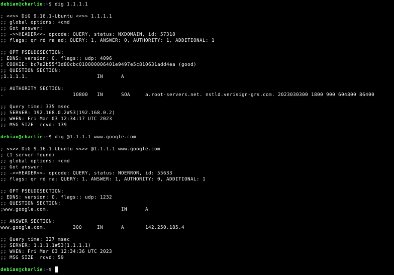

# **SAD**
## **Cortafuegos perimetral sobre escenario**
#### Realizado por: **Iván Piña Castillo**

------------------------------------------------------------------------------------------------------------------------------------------------

### **Descripción**

Sobre el escenario creado en el módulo de servicios con las máquinas Alfa (Router), Bravo (DMZ), Charlie y Delta (LAN) y empleando iptables o nftables, configura un cortafuegos perimetral en la máquina Alfa de forma que el escenario siga funcionando completamente teniendo en cuenta los siguientes puntos:

• Política por defecto DROP para las cadenas INPUT, FORWARD y OUTPUT.

• Se pueden usar las extensiones que creamos adecuadas, pero al menos debe implementarse seguimiento de la conexión.

• Debemos implementar que el cortafuegos funcione después de un reinicio de la máquina.

• Debes indicar pruebas de funcionamiento de todas las reglas.

• El cortafuego debe cumplir al menos estas reglas:
    
    ◦ La máquina Alfa tiene un servidor ssh escuchando por el puerto 22, pero al acceder desde el exterior habrá que conectar al puerto 2222.
    
    ◦ Desde Charlie y Bravo se debe permitir la conexión ssh por el puerto 22 a la máquina Alfa.
    
    ◦ La máquina Alfa debe tener permitido el tráfico para la interfaz loopback.
    
    ◦ A la máquina Alfa se le puede hacer ping desde la DMZ, pero desde la LAN se le debe rechazar la conexión (REJECT) y desde el exterior se rechazará de manera silenciosa.
    
    ◦ La máquina Alfa puede hacer ping a la LAN, la DMZ y al exterior.
    
    ◦ Desde la máquina Bravo se puede hacer ping y conexión ssh a las máquinas de la LAN.
    
    ◦ Desde cualquier máquina de la LAN se puede conectar por ssh a la máquina Bravo.
    
    ◦ Configura la máquina Alfa para que las máquinas de LAN y DMZ puedan acceder al exterior.
    
    ◦ Las máquinas de la LAN pueden hacer ping al exterior y navegar.
    
    ◦ La máquina Bravo puede navegar. Instala un servidor web, un servidor ftp y un servidor de correos si no los tienes aún.
    
    ◦ Configura la máquina Alfa para que los servicios web y ftp sean accesibles desde el exterior.
    
    ◦ El servidor web y el servidor ftp deben ser accesibles desde la LAN y desde el exterior.
    
    ◦ El servidor de correos sólo debe ser accesible desde la LAN.
    
    ◦ En la máquina Delta instala un servidor mysql si no lo tiene aún. A este servidor se puede acceder desde la DMZ, pero no desde el exterior.
    
    ◦ Evita ataques DoS por ICMP Flood, limitando el número de peticiones por segundo desde una misma IP.
    
    ◦ Evita ataques DoS por SYN Flood.
    
    ◦ Evita que realicen escaneos de puertos a Alfa.

------------------------------------------------------------------------------------------------------------------------------------------------

### **Persistencia**

Para hacer que las reglas que hagamos sean permanentes, es decir, que se vuelvan a crear automáticamente después de un reinicio. Para ello, guardaremos todas las reglas en un script, y dicho script será ejecutado en cada reinicio gracias a una unidad systemd que crearemos. Así pues, la unidad systemd es la siguiente:
```bash
nano /etc/systemd/system/iptables.service

[Unit]
Description=Reglas de iptables
After=systemd-sysctl.service

[Service]
Type=oneshot
ExecStart=/usr/local/bin/iptables.sh

[Install]
WantedBy=multi-user.target
```

Tras crear esta unidad, la habilitamos:
```bash
systemctl enable iptables.service
```

En dicha unidad, aparece referenciado el siguiente fichero, el cual contendrá todas las reglas. Además de dicho fichero, en esta práctica, crearé un apartado para cada bloque de reglas y demostrar su funcionamiento. Así pues, el fichero final sería el siguiente:

```bash
nano /usr/local/bin/iptables.sh

#! /bin/sh

### Limpieza de reglas antiguas.
iptables -F
iptables -t nat -F
iptables -Z
iptables -t nat -Z

### Política por defecto.
iptables -P INPUT DROP
iptables -P OUTPUT DROP
iptables -P FORWARD DROP

### La máquina Alfa debe tener permitido el tráfico para la interfaz loopback.
iptables -A INPUT -i lo -p icmp -j ACCEPT
iptables -A OUTPUT -o lo -p icmp -j ACCEPT

### La máquina Alfa tiene un servidor ssh escuchando por el puerto 22, pero al acceder desde el exterior habrá que conectar al puerto 2222.
iptables -t nat -A PREROUTING -p tcp --dport 2222 -i ens3 -j DNAT --to 10.0.0.219:22
iptables -A INPUT -i ens3 -p tcp --dport 22 -m state --state NEW,ESTABLISHED -j ACCEPT
iptables -A OUTPUT -o ens3 -p tcp --sport 22 -m state --state ESTABLISHED -j ACCEPT

### Los contenedores lxc de Alfa (que son Charlie y Delta) deben seguir funcionando.
iptables -A POSTROUTING -o lxcbr0 -p udp -m udp --dport 68 -j CHECKSUM --checksum-fill
iptables -A INPUT -i lxcbr0 -p tcp -m tcp --dport 53 -j ACCEPT
iptables -A INPUT -i lxcbr0 -p udp -m udp --dport 53 -j ACCEPT
iptables -A INPUT -i lxcbr0 -p tcp -m tcp --dport 67 -j ACCEPT
iptables -A INPUT -i lxcbr0 -p udp -m udp --dport 67 -j ACCEPT
iptables -A FORWARD -o lxcbr0 -j ACCEPT
iptables -A FORWARD -i lxcbr0 -j ACCEPT

### Alfa tendrá permitida la conexion ssh a cualquier máquina de la red LAN y la red DMZ (de esta forma podremos seguir trabajando con el escenario en cuanto a la hora de conectarnos por ssh).
iptables -A OUTPUT -d 192.168.0.0/24 -p tcp --dport 22 -m state --state NEW,ESTABLISHED -j ACCEPT
iptables -A INPUT -s 192.168.0.0/24 -p tcp --sport 22 -m state --state ESTABLISHED -j ACCEPT

iptables -A OUTPUT -d 172.16.0.0/16 -p tcp --dport 22 -m state --state NEW,ESTABLISHED -j ACCEPT
iptables -A INPUT -s 172.16.0.0/16 -p tcp --sport 22 -m state --state ESTABLISHED -j ACCEPT

### Desde Charlie y Bravo se debe permitir la conexion ssh por el puerto 22 a la maquina Alfa.
iptables -A OUTPUT -d 192.168.0.2/24 -p tcp --sport 22 -m state --state ESTABLISHED -j ACCEPT
iptables -A INPUT -s 192.168.0.2/24 -p tcp --dport 22 -m state --state NEW,ESTABLISHED -j ACCEPT

iptables -A OUTPUT -d 172.16.0.200/16 -p tcp --sport 22 -m state --state ESTABLISHED -j ACCEPT
iptables -A INPUT -s 172.16.0.200/16 -p tcp --dport 22 -m state --state NEW,ESTABLISHED -j ACCEPT

### A la maquina Alfa se le puede hacer ping desde la DMZ, pero desde la LAN se le debe rechazar la conexión (REJECT) y desde el exterior se rechazara de manera silenciosa.
#iptables -A INPUT -s 172.16.0.200/16 -p icmp -m icmp --icmp-type echo-request -j ACCEPT
iptables -A OUTPUT -d 172.16.0.200/16 -p icmp -m icmp --icmp-type echo-reply -j ACCEPT

iptables -A INPUT -s 192.168.0.0/24 -p icmp -m icmp --icmp-type echo-request -j REJECT
iptables -A OUTPUT -d 192.168.0.0/24 -p icmp -m icmp --icmp-type echo-reply -j REJECT

### La maquina Alfa puede hacer ping a la LAN, la DMZ y al exterior.
iptables -A OUTPUT -p icmp -m icmp --icmp-type echo-request -j ACCEPT
iptables -A INPUT -p icmp -m icmp --icmp-type echo-reply -j ACCEPT

### Desde la maquina Bravo se puede hacer ping y conexion ssh a las maquinas de la LAN.
iptables -A FORWARD -s 172.16.0.200/16 -d 192.168.0.0/24 -p icmp -m icmp --icmp-type echo-request -j ACCEPT
iptables -A FORWARD -d 172.16.0.200/16 -s 192.168.0.0/24 -p icmp -m icmp --icmp-type echo-reply -j ACCEPT

iptables -A FORWARD -s 172.16.0.200/24 -d 192.168.0.0/24 -p tcp --dport 22 -m state --state NEW,ESTABLISHED -j ACCEPT
iptables -A FORWARD -d 172.16.0.200/24 -s 192.168.0.0/24 -p tcp --sport 22 -m state --state ESTABLISHED -j ACCEPT

### Desde cualquier maquina de la LAN se puede conectar por ssh a la maquina Bravo.
iptables -A FORWARD -s 192.168.0.0/24 -d 172.16.0.200/32 -p tcp --dport 22 -m state --state NEW,ESTABLISHED -j ACCEPT
iptables -A FORWARD -s 172.16.0.200/16 -d 192.168.0.0/24 -p tcp --sport 22 -m state --state ESTABLISHED -j ACCEPT

### Configura la maquina Alfa para que las maquinas de LAN y DMZ puedan acceder al exterior.
iptables -t nat -A POSTROUTING -s 172.16.0.0/16 -o ens3 -j MASQUERADE
iptables -A FORWARD -i ens4 -o ens3 -p icmp -m icmp --icmp-type echo-request -j ACCEPT
iptables -A FORWARD -i ens3 -o ens4 -p icmp -m icmp --icmp-type echo-reply -j ACCEPT

iptables -t nat -A POSTROUTING -s 192.168.0.0/24 -o ens3 -j MASQUERADE
iptables -A FORWARD -i br-intra -o ens3 -p icmp -m icmp --icmp-type echo-request -j ACCEPT
iptables -A FORWARD -i ens3 -o br-intra -p icmp -m icmp --icmp-type echo-reply -j ACCEPT

### Las maquinas de la LAN pueden hacer ping al exterior y navegar.
iptables -A FORWARD -i br-intra -o ens3 -p tcp --dport 80 -m state --state NEW,ESTABLISHED -j ACCEPT
iptables -A FORWARD -i ens3 -o br-intra -p tcp --sport 80 -m state --state ESTABLISHED -j ACCEPT

iptables -A FORWARD -i br-intra -o ens3 -p tcp --dport 443 -m state --state NEW,ESTABLISHED -j ACCEPT
iptables -A FORWARD -i ens3 -o br-intra -p tcp --sport 443 -m state --state ESTABLISHED -j ACCEPT

### La maquina Bravo puede navegar.
iptables -A FORWARD -i ens4 -o ens3 -p tcp --dport 80 -m state --state NEW,ESTABLISHED -j ACCEPT
iptables -A FORWARD -i ens3 -o ens4 -p tcp --sport 80 -m state --state ESTABLISHED -j ACCEPT

iptables -A FORWARD -i ens4 -o ens3 -p tcp --dport 443 -m state --state NEW,ESTABLISHED -j ACCEPT
iptables -A FORWARD -i ens3 -o ens4 -p tcp --sport 443 -m state --state ESTABLISHED -j ACCEPT

### Las consultas DNS estarán permitidas en el escenario (las consultas a Charlie desde el exterior, también).
iptables -A OUTPUT -p udp --dport 53 -m state --state NEW,ESTABLISHED -j ACCEPT
iptables -A INPUT -p udp --sport 53 -m state --state ESTABLISHED -j ACCEPT

iptables -t nat -A PREROUTING -p udp -i ens3 --dport 53 -j DNAT --to 192.168.0.2
iptables -A FORWARD -p udp --dport 53 -m state --state NEW,ESTABLISHED -j ACCEPT
iptables -A FORWARD -p udp --sport 53 -m state --state ESTABLISHED -j ACCEPT

### Al servidor MariaDb en Delta se puede acceder desde la DMZ, pero no desde el exterior.
iptables -A FORWARD -i ens4 -o br-intra -p tcp --dport 3306 -m state --state NEW,ESTABLISHED -j ACCEPT
iptables -A FORWARD -i br-intra -o ens4 -p tcp --sport 3306 -m state --state ESTABLISHED -j ACCEPT

### Configura la maquina Alfa para que los servicios web y ftp sean accesibles desde el exterior.
iptables -t nat -A PREROUTING -p tcp -i ens3 --dport 80 -j DNAT --to 172.16.0.200
iptables -A FORWARD -i ens3 -o ens4 -p tcp --dport 80 -m state --state NEW,ESTABLISHED -j ACCEPT
iptables -A FORWARD -i ens4 -o ens3 -p tcp --sport 80 -m state --state ESTABLISHED -j ACCEPT

iptables -t nat -A PREROUTING -p tcp -i ens3 --dport 21 -j DNAT --to 172.16.0.200
iptables -A FORWARD -i ens3 -o ens4 -p tcp --dport 21 -m state --state NEW,ESTABLISHED -j ACCEPT
iptables -A FORWARD -i ens4 -o ens3 -p tcp --sport 21 -m state --state ESTABLISHED -j ACCEPT

### El servidor web y el servidor ftp deben ser accesibles desde la LAN.
iptables -A FORWARD -i br-intra -o ens4 -p tcp --dport 80 -m state --state NEW,ESTABLISHED -j ACCEPT
iptables -A FORWARD -i ens4 -o br-intra -p tcp --sport 80 -m state --state ESTABLISHED -j ACCEPT

iptables -A FORWARD -i br-intra -o ens4 -p tcp --dport 21 -m state --state NEW,ESTABLISHED -j ACCEPT
iptables -A FORWARD -i ens4 -o br-intra -p tcp --sport 21 -m state --state ESTABLISHED -j ACCEPT

### El servidor de correos solo debe ser accesible desde la LAN.
iptables -A FORWARD -i br-intra -o ens4 -p tcp --dport 25 -m state --state NEW,ESTABLISHED -j ACCEPT
iptables -A FORWARD -i ens4 -o br-intra -p tcp --sport 25 -m state --state ESTABLISHED -j ACCEPT

### Evita ataques DoS por ICMP Flood, limitando el numero de peticiones por segundo desde una misma IP.
iptables -A INPUT -i ens4 -p icmp -m state --state NEW --icmp-type echo-request -m limit --limit 1/s --limit-burst 1 -j ACCEPT

### Evita ataques DoS por SYN Flood.
iptables -N syn_flood
iptables -A INPUT -p tcp --syn -j syn_flood
iptables -A syn_flood -m limit --limit 1/s --limit-burst 3 -j RETURN
iptables -A syn_flood -j DROP

### Evita que realicen escaneos de puertos a Alfa.
iptables -N antiscan
iptables -A antiscan -j DROP

### El servidor DNS de Charlie podrá hacer peticiones DNS a otros servidores.
iptables -A OUTPUT -p tcp --dport 53 -m state --state NEW,ESTABLISHED -j ACCEPT
iptables -A INPUT -p tcp --sport 53 -m state --state ESTABLISHED -j ACCEPT

iptables -A FORWARD -p tcp --dport 53 -m state --state NEW,ESTABLISHED -j ACCEPT
iptables -A FORWARD -p tcp --sport 53 -m state --state ESTABLISHED -j ACCEPT

### Alfa tendrá permitido navegar.
iptables -A OUTPUT -o ens3 -p tcp --dport 80 -m state --state NEW,ESTABLISHED -j ACCEPT
iptables -A INPUT -i ens3 -p tcp --sport 80 -m state --state ESTABLISHED -j ACCEPT

iptables -A OUTPUT -o ens3 -p tcp --dport 443 -m state --state NEW,ESTABLISHED -j ACCEPT
iptables -A INPUT -i ens3 -p tcp --sport 443 -m state --state ESTABLISHED -j ACCEPT

### Se podrán hacer consultas al servidor LDAP desde cualquier maquina del escenario y desde el exterior.
iptables -t nat -A PREROUTING -p tcp -i ens3 --dport 389 -j DNAT --to 192.168.0.2
iptables -t nat -A PREROUTING -p tcp -i ens3 --dport 636 -j DNAT --to 192.168.0.2

iptables -A OUTPUT -p tcp --dport 389 -m state --state NEW,ESTABLISHED -j ACCEPT
iptables -A INPUT -p tcp --sport 389 -m state --state ESTABLISHED -j ACCEPT

iptables -A OUTPUT -p tcp --dport 636 -m state --state NEW,ESTABLISHED -j ACCEPT
iptables -A INPUT -p tcp --sport 636 -m state --state ESTABLISHED -j ACCEPT

iptables -A FORWARD -p tcp --dport 389 -m state --state NEW,ESTABLISHED -j ACCEPT
iptables -A FORWARD -p tcp --sport 389 -m state --state ESTABLISHED -j ACCEPT

iptables -A FORWARD -p tcp --dport 636 -m state --state NEW,ESTABLISHED -j ACCEPT
iptables -A FORWARD -p tcp --sport 636 -m state --state ESTABLISHED -j ACCEPT

### El director Bacula en Delta podrá conectarse a todas las máquinas del escenario.
iptables -A OUTPUT -p tcp -m multiport --sport 9101,9102,9103 -m state --state ESTABLISHED -j ACCEPT
iptables -A INPUT -p tcp -m multiport --dport 9101,9102,9103 -m state --state NEW,ESTABLISHED -j ACCEPT

iptables -A FORWARD -p tcp -m multiport --dport 9101,9102,9103 -m state --state NEW,ESTABLISHED -j ACCEPT
iptables -A FORWARD -p tcp -m multiport --sport 9101,9102,9103 -m state --state ESTABLISHED -j ACCEPT
```

Damos los permisos de ejecución al fichero:
```bash
chmod +x /usr/local/bin/iptables.sh
```

Quiero destacar que antes de hacer persistente la configuración de iptables, he ido probando cada regla para asegurarme de que funcionaba correctamente. Sin embargo, para este práctica he visto mejor mostrar directamente que funciona el script, y no hacerlo paso a paso. De igual manera, en cada ejercicio pondré las reglas que he utilizado para que se vea que funcionan correctamente.
Las reglas que no funcionan o me faltan, se ha debido a la falta de tiempo para poder realizarlas.

### 1. La máquina Alfa tiene un servidor ssh escuchando por el puerto 22, pero al acceder desde el exterior habrá que conectar al puerto 2222.
```bash
iptables -t nat -A PREROUTING -p tcp --dport 2222 -i ens3 -j DNAT --to 10.0.0.219:22
iptables -A INPUT -i ens3 -p tcp --dport 22 -m state --state NEW,ESTABLISHED -j ACCEPT
iptables -A OUTPUT -o ens3 -p tcp --sport 22 -m state --state ESTABLISHED -j ACCEPT
```

Prueba de que funciona:
```bash
ssh debian@172.22.200.150 -p 2222
```


### 2. Desde Charlie y Bravo se debe permitir la conexión ssh por el puerto 22 a la máquina Alfa.
```bash
iptables -A OUTPUT -d 192.168.0.2/24 -p tcp --sport 22 -m state --state ESTABLISHED -j ACCEPT
iptables -A INPUT -s 192.168.0.2/24 -p tcp --dport 22 -m state --state NEW,ESTABLISHED -j ACCEPT

iptables -A OUTPUT -d 172.16.0.200/16 -p tcp --sport 22 -m state --state ESTABLISHED -j ACCEPT
iptables -A INPUT -s 172.16.0.200/16 -p tcp --dport 22 -m state --state NEW,ESTABLISHED -j ACCEPT
```

Prueba de que funciona desde Charlie:
```bash
ssh debian@192.168.0.1
```


```bash
ssh debian@172.16.0.1
```


### 3. La máquina Alfa debe tener permitido el tráfico para la interfaz loopback.
```bash
iptables -A INPUT -i lo -p icmp -j ACCEPT
iptables -A OUTPUT -o lo -p icmp -j ACCEPT
```

Prueba de que funciona:
```bash
ping 127.0.0.1
```


### 4. A la máquina Alfa se le puede hacer ping desde la DMZ, pero desde la LAN se le debe rechazar la conexión (REJECT) y desde el exterior se rechazará de manera silenciosa.
```bash
iptables -A INPUT -s 172.16.0.200/16 -p icmp -m icmp --icmp-type echo-request -j ACCEPT
iptables -A OUTPUT -d 172.16.0.200/16 -p icmp -m icmp --icmp-type echo-reply -j ACCEPT

iptables -A INPUT -s 192.168.0.0/24 -p icmp -m icmp --icmp-type echo-request -j REJECT
iptables -A OUTPUT -d 192.168.0.0/24 -p icmp -m icmp --icmp-type echo-reply -j REJECT
```

Prueba de que funciona desde la DMZ:
```bash
ping 172.16.0.1
```


Prueba de que no funciona desde la LAN:
```bash
ping 192.168.0.1
```


Prueba de que no funciona desde el exterior:
```bash
ping 172.22.200.150
```


### 5. La máquina Alfa puede hacer ping a la LAN, la DMZ y al exterior.
```bash
iptables -A OUTPUT -p icmp -m icmp --icmp-type echo-request -j ACCEPT
iptables -A INPUT -p icmp -m icmp --icmp-type echo-reply -j ACCEPT
```

Prueba de que funciona desde la LAN:
```bash
ping 192.168.0.2
```


```bash
ping 192.168.0.3
```


Prueba de que funciona desde la DMZ:
```bash
ping 172.16.0.200
```


Prueba de que funciona desde el exterior:
```bash
ping 8.8.8.8
```


### 6. Desde la máquina Bravo se puede hacer ping y conexión ssh a las máquinas de la LAN.
```bash
iptables -A FORWARD -s 172.16.0.200/16 -d 192.168.0.0/24 -p icmp -m icmp --icmp-type echo-request -j ACCEPT
iptables -A FORWARD -d 172.16.0.200/16 -s 192.168.0.0/24 -p icmp -m icmp --icmp-type echo-reply -j ACCEPT

iptables -A FORWARD -s 172.16.0.200/16 -d 192.168.0.0/24 -p tcp --dport 22 -m state --state NEW,ESTABLISHED -j ACCEPT
iptables -A FORWARD -d 172.16.0.200/16 -s 192.168.0.0/24 -p tcp --sport 22 -m state --state ESTABLISHED -j ACCEPT
```

Prueba de que funciona el ping:
```bash
ping 192.168.0.2
```


```bash
ping 192.168.0.3
```


Prueba de que funciona la conexión ssh:
```bash
ssh debian@192.168.0.2
```


```bash
ssh debian@192.168.0.3
```


### 7. Desde cualquier máquina de la LAN se puede conectar por ssh a la máquina Bravo.
```bash
iptables -A FORWARD -s 192.168.0.0/24 -d 172.16.0.200/16 -p tcp --dport 22 -m state --state NEW,ESTABLISHED -j ACCEPT
iptables -A FORWARD -s 172.16.0.200/16 -d 192.168.0.0/24 -p tcp --sport 22 -m state --state ESTABLISHED -j ACCEPT
```

Prueba de que funciona desde Charlie:
```bash
ssh debian@172.16.0.200
```


Prueba de que funciona desde Delta:
```bash
ssh debian@172.16.0.200
```


### 8. Configura la máquina Alfa para que las máquinas de LAN y DMZ puedan acceder al exterior.
```bash
iptables -t nat -A POSTROUTING -s 172.16.0.0/16 -o ens3 -j MASQUERADE
iptables -A FORWARD -i ens4 -o ens3 -p icmp -m icmp --icmp-type echo-request -j ACCEPT
iptables -A FORWARD -i ens3 -o ens4 -p icmp -m icmp --icmp-type echo-reply -j ACCEPT

iptables -t nat -A POSTROUTING -s 192.168.0.0/24 -o ens3 -j MASQUERADE
iptables -A FORWARD -i br-intra -o ens3 -p icmp -m icmp --icmp-type echo-request -j ACCEPT
iptables -A FORWARD -i ens3 -o br-intra -p icmp -m icmp --icmp-type echo-reply -j ACCEPT
```

Prueba de que funciona desde la DMZ:
```bash
ping 8.8.8.8
```


Prueba de que funciona desde la LAN:
```bash
ping 8.8.8.8
```


### 9. Las máquinas de la LAN pueden hacer ping al exterior y navegar.

El ping ya vimos que funciona en el apartado anterior. Así que vamos a ver como navegar.

```bash
iptables -A FORWARD -i br-intra -o ens3 -p tcp --dport 80 -m state --state NEW,ESTABLISHED -j ACCEPT
iptables -A FORWARD -i ens3 -o br-intra -p tcp --sport 80 -m state --state ESTABLISHED -j ACCEPT

iptables -A FORWARD -i br-intra -o ens3 -p tcp --dport 443 -m state --state NEW,ESTABLISHED -j ACCEPT
iptables -A FORWARD -i ens3 -o br-intra -p tcp --sport 443 -m state --state ESTABLISHED -j ACCEPT
```

Prueba de que funciona:
```bash
curl www.google.com 80
```


```bash
curl www.google.com 443
```


### 10. La máquina Bravo puede navegar. Instala un servidor web, un servidor ftp y un servidor de correos si no los tienes aún (Delta ya tiene un servidor de correos así que usaré el de Delta).
```bash
iptables -A FORWARD -i ens4 -o ens3 -p tcp --dport 80 -m state --state NEW,ESTABLISHED -j ACCEPT
iptables -A FORWARD -i ens3 -o ens4 -p tcp --sport 80 -m state --state ESTABLISHED -j ACCEPT

iptables -A FORWARD -i ens4 -o ens3 -p tcp --dport 443 -m state --state NEW,ESTABLISHED -j ACCEPT
iptables -A FORWARD -i ens3 -o ens4 -p tcp --sport 443 -m state --state ESTABLISHED -j ACCEPT
```

Prueba de que funciona:
```bash
curl www.google.com 80
```


```bash
curl www.google.com 443
```


### 11. Configura la máquina Alfa para que los servicios web y ftp sean accesibles desde el exterior.
```bash
iptables -t nat -A PREROUTING -p tcp -i ens3 --dport 80 -j DNAT --to 172.16.0.200
iptables -A FORWARD -i ens3 -o ens4 -p tcp --dport 80 -m state --state NEW,ESTABLISHED -j ACCEPT
iptables -A FORWARD -i ens4 -o ens3 -p tcp --sport 80 -m state --state ESTABLISHED -j ACCEPT

iptables -t nat -A PREROUTING -p tcp -i ens3 --dport 21 -j DNAT --to 172.16.0.200
iptables -A FORWARD -i ens3 -o ens4 -p tcp --dport 21 -m state --state NEW,ESTABLISHED -j ACCEPT
iptables -A FORWARD -i ens4 -o ens3 -p tcp --sport 21 -m state --state ESTABLISHED -j ACCEPT
```

Prueba de que funciona el FTP:
```bash
telnet 172.22.200.150 21
```


Prueba de que funciona el servidor web:


### 12. El servidor web y el servidor ftp deben ser accesibles desde la LAN y desde el exterior.

Antes ya comprobamos que funcionaba desde el exterior, ahora vamos a comprobar que funciona desde la LAN.

```bash
iptables -A FORWARD -i br-intra -o ens4 -p tcp --dport 80 -m state --state NEW,ESTABLISHED -j ACCEPT
iptables -A FORWARD -i ens4 -o br-intra -p tcp --sport 80 -m state --state ESTABLISHED -j ACCEPT

iptables -A FORWARD -i br-intra -o ens4 -p tcp --dport 21 -m state --state NEW,ESTABLISHED -j ACCEPT
iptables -A FORWARD -i ens4 -o br-intra -p tcp --sport 21 -m state --state ESTABLISHED -j ACCEPT
```

Prueba de que el servidor web funciona desde la LAN:
```bash
curl 172.16.0.200 80
```


Prueba de que el servidor FTP funciona desde la LAN:
```bash
telnet 172.16.0.200 21
```


### 13. El servidor de correos sólo debe ser accesible desde la LAN.
```bash
iptables -A FORWARD -i br-intra -o ens4 -p tcp --dport 25 -m state --state NEW,ESTABLISHED -j ACCEPT
iptables -A FORWARD -i ens4 -o br-intra -p tcp --sport 25 -m state --state ESTABLISHED -j ACCEPT
```

Prueba de que funciona desde la LAN:
```bash
telnet 172.16.0.200 25
```


Prueba de que no funciona desde el exterior:
```bash
telnet 172.22.200.150 25
```


### 14. En la máquina Delta instala un servidor mysql si no lo tiene aún. A este servidor se puede acceder desde la DMZ, pero no desde el exterior.
```bash
iptables -A FORWARD -i ens4 -o br-intra -p tcp --dport 3306 -m state --state NEW,ESTABLISHED -j ACCEPT
iptables -A FORWARD -i br-intra -o ens4 -p tcp --sport 3306 -m state --state ESTABLISHED -j ACCEPT
```

Prueba de que funciona desde la DMZ:
```bash
telnet 192.168.0.3 3306
```


Prueba de que no funciona desde el exterior:
```bash
telnet 172.22.200.150 3306
```


### 15. Evita ataques DoS por ICMP Flood, limitando el número de peticiones por segundo desde una misma IP.

Si hacemos memoria, el ping ya se encuentra bloqueado tanto en el exterior como en la LAN, por lo que no es necesario bloquearlo de nuevo. Solo tendríamos que bloquear el ping desde la DMZ a Alfa. (En mi caso, comentaré la regla que permitía hacer ping desde la DMZ a Alfa).
```bash
iptables -A INPUT -i ens4 -p icmp -m state --state NEW --icmp-type echo-request -m limit --limit 1/s --limit-burst 1 -j ACCEPT
```

ICMP Flood desde Bravo a Alfa:
```bash
ping 172.16.0.1 -f
```


ICMP Flood desde Charlie a Alfa:
```bash
ping 192.168.0.1 -f
```


Y desde el exterior:
```bash
ping 172.22.200.150 -f
```


### 16. Evita ataques DoS por SYN Flood.
```bash
iptables -N syn_flood
iptables -A INPUT -p tcp --syn -j syn_flood
iptables -A syn_flood -m limit --limit 1/s --limit-burst 3 -j RETURN
iptables -A syn_flood -j DROP
```

SYN Flood desde Delta a Alfa:
```bash
hping3 -a 8.8.8.8 -S --flood 192.168.0.1
```


Como podemos ver, se han perdido todos los paquetes.

### 17. Evita que realicen escaneos de puertos a Alfa.
```bash
iptables -N antiscan
iptables -A antiscan -j DROP
```

Realizamos un escaneo de puertos desde el exterior a Alfa:
```bash
nmap -sN 172.22.200.150
```


Como vemos, nos dice que es probable que a quien le estemos haciendo el escaneo tenga lo tenga bloqueado.

-----------------------------------------------------------------------------------------------------------------------------------

A partir de este punto ya habríamos terminado con las reglas mínimas exigidas para la práctica. A continuación, voy a añadir algunas reglas más para que el escenario funcione sin problemas y para poder seguir trabajando con él como he estado haciendo hasta ahora.

### 18. Alfa tendrá permitido navegar.
```bash
iptables -A OUTPUT -o ens3 -p tcp --dport 80 -m state --state NEW,ESTABLISHED -j ACCEPT
iptables -A INPUT -i ens3 -p tcp --sport 80 -m state --state ESTABLISHED -j ACCEPT

iptables -A OUTPUT -o ens3 -p tcp --dport 443 -m state --state NEW,ESTABLISHED -j ACCEPT
iptables -A INPUT -i ens3 -p tcp --sport 443 -m state --state ESTABLISHED -j ACCEPT
```

Prueba de que funciona desde Alfa a Google:
```bash
curl www.google.com 80
```


```bash
curl www.google.com 443
```


### 19. Las consultas DNS estarán permitidas en el escenario (las consultas a Charlie desde el exterior, también).
```bash
iptables -A OUTPUT -p udp --dport 53 -m state --state NEW,ESTABLISHED -j ACCEPT
iptables -A INPUT -p udp --sport 53 -m state --state ESTABLISHED -j ACCEPT

iptables -t nat -A PREROUTING -p udp -i ens3 --dport 53 -j DNAT --to 192.168.0.2
iptables -A FORWARD -p udp --dport 53 -m state --state NEW,ESTABLISHED -j ACCEPT
iptables -A FORWARD -p udp --sport 53 -m state --state ESTABLISHED -j ACCEPT
```

Prueba de que funciona desde la DMZ a Charlie:
```bash
dig @192.168.0.2 www.google.com
dig @192.168.0.2 alfa.ivan.gonzalonazareno.org
```


Prueba de que funciona desde el exterior a Charlie:
```bash
dig @172.22.200.150 www.google.com
dig @172.22.200.150 alfa.ivan.gonzalonazareno.org
```


Prueba de que funciona desde la LAN a Charlie:
```bash
dig @192.168.0.2 www.google.com
dig @192.168.0.2 alfa.ivan.gonzalonazareno.org
```


### 20. El servidor DNS de Charlie podrá hacer peticiones DNS a otros servidores.
```bash
iptables -A OUTPUT -p tcp --dport 53 -m state --state NEW,ESTABLISHED -j ACCEPT
iptables -A INPUT -p tcp --sport 53 -m state --state ESTABLISHED -j ACCEPT

iptables -A FORWARD -p tcp --dport 53 -m state --state NEW,ESTABLISHED -j ACCEPT
iptables -A FORWARD -p tcp --sport 53 -m state --state ESTABLISHED -j ACCEPT
```

Prueba de que funciona desde Charlie a Google:



### 21. Se podrán hacer consultas al servidor LDAP desde cualquier maquina del escenario.
```bash
iptables -t nat -A PREROUTING -p tcp -i ens3 --dport 389 -j DNAT --to 192.168.0.2
iptables -t nat -A PREROUTING -p tcp -i ens3 --dport 636 -j DNAT --to 192.168.0.2

iptables -A OUTPUT -p tcp --dport 389 -m state --state NEW,ESTABLISHED -j ACCEPT
iptables -A INPUT -p tcp --sport 389 -m state --state ESTABLISHED -j ACCEPT

iptables -A OUTPUT -p tcp --dport 636 -m state --state NEW,ESTABLISHED -j ACCEPT
iptables -A INPUT -p tcp --sport 636 -m state --state ESTABLISHED -j ACCEPT

iptables -A FORWARD -p tcp --dport 389 -m state --state NEW,ESTABLISHED -j ACCEPT
iptables -A FORWARD -p tcp --sport 389 -m state --state ESTABLISHED -j ACCEPT

iptables -A FORWARD -p tcp --dport 636 -m state --state NEW,ESTABLISHED -j ACCEPT
iptables -A FORWARD -p tcp --sport 636 -m state --state ESTABLISHED -j ACCEPT
```

Desde Bravo (DMZ):
```bash
ldapsearch -x -b dc=ivan,dc=gonzalonazareno,dc=org -H ldap://alfa.ivan.gonzalonazareno.org
```


Desde Charlie (LAN):
```bash
ldapsearch -x -b dc=ivan,dc=gonzalonazareno,dc=org -H ldap://alfa.ivan.gonzalonazareno.org
```


### 22. El director Bacula en Delta podrá conectarse a todas las máquinas del escenario.
```bash
iptables -A OUTPUT -p tcp -m multiport --sport 9101,9102,9103 -m state --state ESTABLISHED -j ACCEPT
iptables -A INPUT -p tcp -m multiport --dport 9101,9102,9103 -m state --state NEW,ESTABLISHED -j ACCEPT

iptables -A FORWARD -p tcp -m multiport --dport 9101,9102,9103 -m state --state NEW,ESTABLISHED -j ACCEPT
iptables -A FORWARD -p tcp -m multiport --sport 9101,9102,9103 -m state --state ESTABLISHED -j ACCEPT
```

Prueba de que es capaz de conectarse a todos:
```bash
bconsole
*status
```


